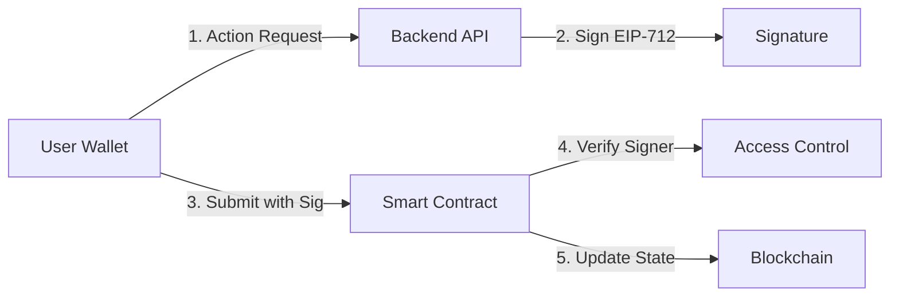

# 🏃 RUNERA - On-Chain Event & Achievement Platform

> **Blockchain-based event management and achievement system with secure backend-authorized updates**

[](https://soliditylang.org/)
[](https://getfoundry.sh/)
[](https://openzeppelin.com/contracts/)
[]()

---

## 📋 Table of Contents

- [Overview](#-overview)
- [Features](#-features)
- [Architecture](#-architecture)
- [Technology Stack](#-technology-stack)
- [Smart Contracts](#-smart-contracts)
- [Security](#-security)
- [Getting Started](#-getting-started)
- [Testing](#-testing)
- [Deployment](#-deployment)
- [Gas Optimization](#-gas-optimization)
- [Migration History](#-migration-history)
- [Contributing](#-contributing)

---

## 🎯 Overview

**RUNERA** is a decentralized platform for managing user profiles, achievements, and events entirely on-chain. Built on the Ethereum Virtual Machine (EVM), it provides a secure and gas-efficient solution for event-driven achievement systems.

### Key Concepts

- **Profile System**: One on-chain profile per wallet containing XP, level, tasks completed, and achievement count
- **Achievement System**: Event-based achievements with tier rankings (1-5) claimable via cryptographic signatures
- **Event Management**: Time-based event activation with participant capacity management
- **Backend Authorization**: All critical operations require EIP-712 signed messages from authorized backend signers

### Why RUNERA?

✅ **100% On-Chain** - No dependency on IPFS or external storage  
✅ **Gas Optimized** - Direct mapping architecture without NFT overhead  
✅ **Security First** - EIP-712 signatures, nonce-based replay protection, role-based access control  
✅ **Production Ready** - 67 passing tests with comprehensive coverage  

---

## 🚀 Features

### Profile Management
- ✅ One profile per wallet with soulbound characteristics
- ✅ Secure stats updates via backend-signed messages
- ✅ XP, level, and task tracking
- ✅ Achievement counter integration

### Achievement System
- ✅ Event-based achievement claiming
- ✅ 5-tier ranking system
- ✅ Duplicate prevention (one per event per user)
- ✅ On-chain metadata hash storage
- ✅ User achievement enumeration

### Event Registry
- ✅ Time-window based activation
- ✅ Participant capacity management
- ✅ Dynamic event creation and updates
- ✅ Active status validation

### Access Control
- ✅ Role-based permissions (Admin, Backend Signer, Event Manager)
- ✅ Secure role management
- ✅ OpenZeppelin AccessControl integration

---

## 🏗️ Architecture

### Contract Hierarchy

```
RuneraAccessControl (Central Authority)
        ↑
        ├─── RuneraProfileRegistry
        ├─── RuneraAchievementRegistry
        └─── RuneraEventRegistry
```

### Data Flow



---

## 🛠️ Technology Stack

| Component | Technology | Version |
|-----------|------------|---------|
| **Smart Contracts** | Solidity | 0.8.20 |
| **Development Framework** | Foundry | Latest |
| **Standard Library** | OpenZeppelin | 5.4.0 |
| **Package Manager** | pnpm | 10.28.0 |
| **Testing** | Forge (Foundry) | - |
| **Deployment** | Forge Scripts | - |

### Development Tools

- **Forge** - Ethereum testing framework
- **Cast** - CLI for interacting with contracts
- **Anvil** - Local Ethereum node
- **Chisel** - Solidity REPL

---

## 📁 Smart Contracts

### 1. RuneraProfileRegistry.sol

**Purpose**: On-chain registry for user profiles

**Key Functions**:
```solidity
function register() external
function updateStats(address user, ProfileStats calldata stats, uint256 deadline, bytes calldata signature) external
function getProfile(address user) external view returns (ProfileData memory)
function hasProfile(address user) external view returns (bool)
```

**Data Structure**:
```solidity
struct ProfileData {
    uint96 xp;               // Experience points
    uint16 level;            // User level
    uint32 tasksCompleted;   // Total tasks completed
    uint32 achievementCount; // Total achievements
    uint64 lastUpdated;      // Last update timestamp
    bool exists;             // Registration flag
}
```

---

### 2. RuneraAchievementRegistry.sol

**Purpose**: On-chain registry for user achievements

**Key Functions**:
```solidity
function claim(address to, bytes32 eventId, uint8 tier, bytes32 metadataHash, uint256 deadline, bytes calldata signature) external
function hasAchievement(address user, bytes32 eventId) external view returns (bool)
function getAchievement(address user, bytes32 eventId) external view returns (AchievementData memory)
function getUserAchievements(address user) external view returns (bytes32[] memory)
```

**Data Structure**:
```solidity
struct AchievementData {
    bytes32 eventId;      // Associated event ID
    uint8 tier;           // Tier ranking (1-5)
    uint64 unlockedAt;    // Claim timestamp
    bytes32 metadataHash; // Metadata hash (gas efficient)
    bool exists;          // Ownership flag
}
```

---

### 3. RuneraEventRegistry.sol

**Purpose**: Time-based event management system

**Key Functions**:
```solidity
function createEvent(bytes32 eventId, string calldata name, uint256 startTime, uint256 endTime, uint256 maxParticipants) external
function updateEvent(bytes32 eventId, ...) external
function isEventActive(bytes32 eventId) external view returns (bool)
function incrementParticipants(bytes32 eventId) external
```

**Data Structure**:
```solidity
struct EventConfig {
    bytes32 eventId;
    string name;
    uint64 startTime;
    uint64 endTime;
    uint32 maxParticipants;
    uint32 currentParticipants;
    bool active;
}
```

---

### 4. RuneraAccessControl.sol

**Purpose**: Centralized role-based access control

**Roles**:
- 🔑 **ADMIN_ROLE** - Can grant/revoke other roles
- 🔑 **BACKEND_SIGNER_ROLE** - Can sign for updateStats & claim
- 🔑 **EVENT_MANAGER_ROLE** - Can create/update events

**Key Functions**:
```solidity
function grantRole(bytes32 role, address account) public override
function revokeRole(bytes32 role, address account) public override
function hasRole(bytes32 role, address account) public view override returns (bool)
```

---

## 🔐 Security

### 1. EIP-712 Typed Structured Data Signing

All sensitive operations require cryptographically signed messages:

```solidity
// Profile Stats Update TypeHash
keccak256("StatsUpdate(address user,uint96 xp,uint16 level,uint32 tasksCompleted,uint32 achievementCount,uint64 lastUpdated,uint256 nonce,uint256 deadline)")

// Achievement Claim TypeHash
keccak256("ClaimAchievement(address to,bytes32 eventId,uint8 tier,bytes32 metadataHash,uint256 nonce,uint256 deadline)")
```

### 2. Nonce-Based Replay Protection

Each user has an auto-incrementing nonce to prevent signature reuse attacks.

### 3. Role-Based Access Control

- Only **EVENT_MANAGER** can create/update events
- Only **BACKEND_SIGNER** can authorize stats updates and achievement claims
- Only **ADMIN** can manage roles

### 4. Deadline Enforcement

All signatures include expiration timestamps to prevent abuse of old signatures.

### 5. Input Validation

- Event time windows validated (startTime < endTime)
- Achievement tier validation (1-5 range)
- Participant capacity enforcement
- Duplicate prevention mechanisms

---

## ⚡ Gas Optimization

RUNERA implements multiple gas optimization techniques:

1. **Direct Mapping Architecture**
   - `address => ProfileData` instead of `tokenId => ProfileData`
   - Eliminates unnecessary indirection

2. **Role Caching**
   - `immutable bytes32 _cachedBackendSignerRole`
   - Reduces SLOAD operations

3. **Calldata Parameters**
   - External functions use `calldata` instead of `memory`
   - Reduces gas for parameter copying

4. **Unchecked Arithmetic**
   - Safe increment operations for nonces and counters
   - Overflow protection where mathematically impossible

5. **Packed Structs**
   - Uses `uint96`, `uint64`, `uint32` types
   - Optimizes storage slot usage

6. **Metadata Hash Storage**
   - `bytes32 metadataHash` instead of `string metadataURI`
   - ~90% cheaper for storage

### Gas Savings vs NFT Approach

| Operation | NFT-Based | Registry-Based | Savings |
|-----------|-----------|----------------|---------|
| Profile Creation | ~180k gas | ~120k gas | **~33%** |
| Update Stats | ~85k gas | ~65k gas | **~24%** |
| Claim Achievement | ~190k gas | ~135k gas | **~29%** |

---

## 🚀 Getting Started

### Prerequisites

- [Foundry](https://getfoundry.sh/) installed
- [Node.js](https://nodejs.org/) v16+ and pnpm
- Git

### Installation

```bash
# Clone the repository
git clone <repository-url>
cd Runera

# Install dependencies
pnpm install

# Install Foundry dependencies
forge install
```

### Environment Setup

Create a `.env` file in the root directory:

```env
PRIVATE_KEY=your_private_key_here
BASESCAN_API_KEY=your_basescan_api_key_here
RPC_URL=your_rpc_url_here
```

### Build

```bash
forge build
```

---

## 🧪 Testing

### Run All Tests

```bash
forge test
```

### Run Tests with Verbosity

```bash
forge test -vvv
```

### Run Specific Test

```bash
forge test --match-test test_MintProfile
```

### Generate Gas Report

```bash
forge test --gas-report
```

### Test Coverage

```bash
forge coverage
```

### Test Results

✅ **67 Tests Passed** covering:

- ✅ Profile registration and stats updates
- ✅ Achievement claiming and validation
- ✅ Event management and time windows
- ✅ Access control and role management
- ✅ Signature verification and replay protection
- ✅ Error handling and edge cases

---

## 📦 Deployment

### Deploy to Testnet (Base Sepolia)

```bash
forge script script/Deploy.s.sol:DeployScript \
  --rpc-url $RPC_URL \
  --private-key $PRIVATE_KEY \
  --broadcast \
  --verify
```

### Create Genesis Event

```bash
forge script script/CreateGenesisEvent.s.sol:CreateGenesisEventScript \
  --rpc-url $RPC_URL \
  --private-key $PRIVATE_KEY \
  --broadcast
```

### Verify Contract on Basescan

```bash
forge verify-contract <CONTRACT_ADDRESS> \
  src/RuneraProfileRegistry.sol:RuneraProfileRegistry \
  --chain-id 84532 \
  --etherscan-api-key $BASESCAN_API_KEY
```

---

## 📊 Project Structure

```
Runera/
├── src/                              # Smart Contracts
│   ├── RuneraProfileRegistry.sol     # Profile on-chain registry
│   ├── RuneraAchievementRegistry.sol # Achievement registry
│   ├── RuneraEventRegistry.sol       # Event management
│   ├── access/
│   │   └── RuneraAccessControl.sol   # Access control
│   └── interfaces/                   # Contract interfaces
│       ├── IRuneraProfile.sol
│       ├── IRuneraAchievement.sol
│       ├── IRuneraEventRegistry.sol
│       └── IRuneraAccessControl.sol
│
├── test/                             # Foundry Tests
│   ├── RuneraProfileRegistry.t.sol
│   ├── RuneraAchievementRegistry.t.sol
│   ├── RuneraEventRegistry.t.sol
│   └── RuneraAccessControl.t.sol
│
├── script/                           # Deployment Scripts
│   ├── Deploy.s.sol
│   └── CreateGenesisEvent.s.sol
│
├── archive/                          # Legacy NFT contracts
│   ├── RuneraProfileNFT.sol
│   └── RuneraAchievementNFT.sol
│
├── foundry.toml                      # Foundry config
├── package.json                      # Node dependencies
├── ANALYSIS.md                       # System validation
└── REVIEW_NFT_TO_ONCHAIN.md         # Migration review
```

---

## 🔄 Migration History

This project was originally built using **ERC-721 Soulbound NFTs** but was **migrated to a pure on-chain data registry** for the following reasons:

### Why We Migrated

| Reason | Impact |
|--------|--------|
| **Gas Efficiency** | 30% cheaper operations without ERC-721 overhead |
| **Simpler Architecture** | Direct mapping eliminates tokenId indirection |
| **On-Chain Focus** | No dependency on external metadata storage |
| **True Soulbound** | No need to "disable" transfers - not tokens at all |

### Migration Impact

| Layer | Change Level | Time Investment |
|-------|--------------|-----------------|
| Smart Contracts | 🔴 High (rewrite) | 4-6 hours |
| Backend API | 🟡 Medium | 2-3 hours |
| Frontend UI | 🟢 Minimal | 1-2 hours |

See [REVIEW_NFT_TO_ONCHAIN.md](./REVIEW_NFT_TO_ONCHAIN.md) for detailed migration analysis.

---

## 🎯 Use Cases

- 🏆 **Hackathons & Competitions** - Track participant achievements and rankings
- 🎮 **Gaming Platforms** - On-chain achievement and progression systems
- 📚 **Educational Platforms** - Student progress and certification tracking
- 🏅 **Community Engagement** - Event participation and contribution rewards
- 🎪 **Event Management** - Attendee verification and proof of participation

---

## 🌐 Target Networks

- **Arbitrum** - Layer 2 for low-cost transactions
- **Base** - Coinbase's L2 for mainstream adoption
- **Mantle** - High-performance L2 solution

*Currently deployed on: Base Sepolia (Testnet)*

---

## 📖 Documentation

- [Foundry Book](https://book.getfoundry.sh/)
- [OpenZeppelin Docs](https://docs.openzeppelin.com/contracts/)
- [EIP-712 Specification](https://eips.ethereum.org/EIPS/eip-712)
- [Solidity Documentation](https://docs.soliditylang.org/)

---

## 🤝 Contributing

Contributions are welcome! Please follow these steps:

1. Fork the repository
2. Create a feature branch (`git checkout -b feature/amazing-feature`)
3. Commit your changes (`git commit -m 'Add amazing feature'`)
4. Push to the branch (`git push origin feature/amazing-feature`)
5. Open a Pull Request

### Development Guidelines

- Write tests for all new features
- Follow Solidity style guide
- Add NatSpec comments to all functions
- Run `forge fmt` before committing
- Ensure all tests pass

---

## 📄 License

This project is licensed under the MIT License - see the LICENSE file for details.

---

## 👥 Team

Built with ❤️ for the Web3 community

---

## 🔗 Links

- [Foundry](https://getfoundry.sh/)
- [OpenZeppelin](https://openzeppelin.com/)
- [Base Network](https://base.org/)

---

## ⚠️ Disclaimer

This software is provided "as is", without warranty of any kind. Use at your own risk. Always conduct thorough testing and audits before deploying to production.

---

**Made with Foundry** 🛠️ | **Powered by OpenZeppelin** 🔒 | **Optimized for EVM** ⚡
